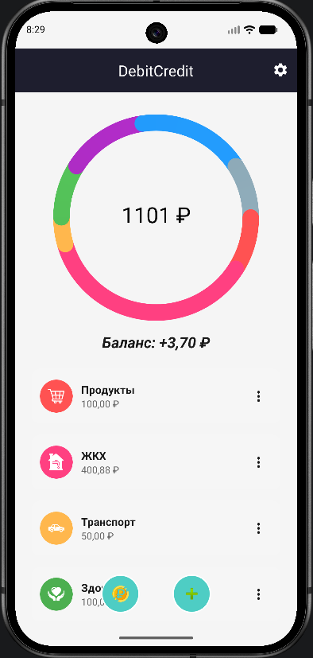
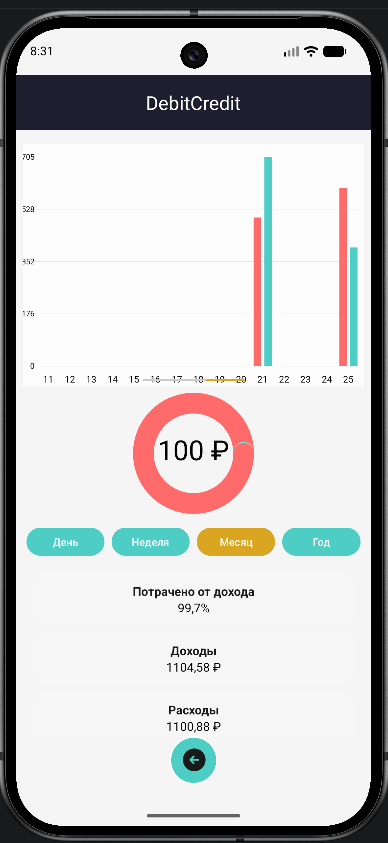
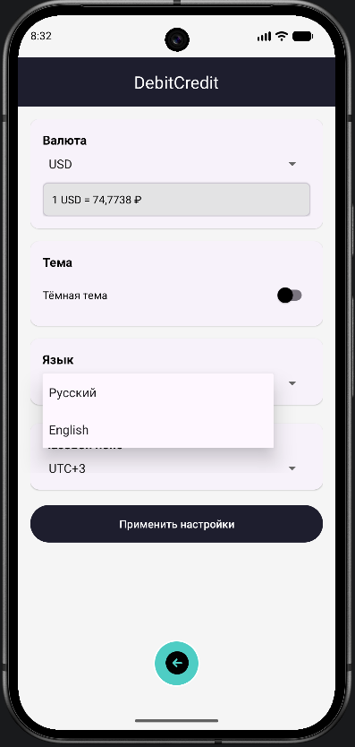

# DebitCredit 

[Android CI](https://github.com/Wiktor-coder/DebitCredit/actions/runs/28165677731/job/83416926296)

Приложение для учёта доходов и расходов на Android.

## 📱 Скриншоты

| Главный экран | Статистика | Настройки |
|--------------|------------|-----------|
|  |  |  |

## ✨ Особенности

### 📊 Учёт финансов
- 📈 Отслеживание расходов по категориям (продукты, транспорт, ЖКХ, здоровье и др.)
- 💰 Добавление доходов с произвольной суммой
- 📊 Детальная статистика с графиками и диаграммами
- 📅 Фильтрация по дням, неделям, месяцам и годам
- 💡 Автоматический расчет баланса

### 🎨 Интерфейс
- 🌙 Поддержка светлой и тёмной темы
- 🌍 Поддержка русского и английского языков
- 📱 Адаптивный дизайн для всех экранов
- 🎯 Интуитивно понятный интерфейс

### 🔔 Уведомления
- ⏰ Ежедневное утреннее уведомление в 8:00
- 📢 Проверка новых версий приложения
- 💬 Благодарственные уведомления при запуске

### 💱 Валюты
- 💲 Автоматическое обновление курсов валют ЦБ РФ
- 🇷🇺 Поддержка RUB, USD, EUR, CNY, GBP, JPY

### ⏰ Часовые пояса
- 🌐 Настройка часового пояса
- 🔄 Корректное отображение времени транзакций

## 🛠️ Технологии

### Архитектура
- **Clean Architecture** - разделение на data, domain и presentation слои
- **MVVM** - Model-View-ViewModel с LiveData и StateFlow
- **DI** - Dagger Hilt для внедрения зависимостей

### Стек технологий
- **Kotlin** - 2.0.21
- **Android Jetpack**:
    - ViewModel - управление UI состоянием
    - Navigation - навигация между экранами
    - Room - локальная база данных
    - LiveData - реактивное обновление UI
    - WorkManager - фоновые задачи
- **Coroutines** - асинхронное программирование
- **Custom Views** - кастомные графики и диаграммы
- **Firebase**:
    - Analytics - аналитика использования
    - Crashlytics - отслеживание ошибок
    - Firestore - облачная база данных для обновлений
- **OkHttp + Gson** - работа с API курсов валют

## 📥 Установка

### Скачать APK
Скачайте последнюю версию из [Releases](https://github.com/Wiktor-coder/DebitCredit/releases)

### 📊 База данных

Приложение использует Room для локального хранения данных:
```agsl
// Категории расходов
CREATE TABLE categories (
id INTEGER PRIMARY KEY AUTOINCREMENT,
name TEXT NOT NULL,
amount REAL DEFAULT 0,
color INTEGER NOT NULL,
iconRes INTEGER DEFAULT 0,
date INTEGER DEFAULT 0
)

// Транзакции (расходы и доходы)
CREATE TABLE transactions (
id INTEGER PRIMARY KEY AUTOINCREMENT,
categoryName TEXT NOT NULL,
amount REAL NOT NULL,
date INTEGER NOT NULL,
type TEXT NOT NULL // 'expense' или 'income'
)

// Доходы (для обратной совместимости)
CREATE TABLE incomes (
id INTEGER PRIMARY KEY AUTOINCREMENT,
amount REAL NOT NULL,
date INTEGER NOT NULL,
note TEXT DEFAULT 
)
```

### 🤝 Вклад в проект

Мы приветствуем вклад в проект!

1. Форкните репозиторий
2. Создайте ветку для вашей фичи (git checkout -b feature/AmazingFeature)
3. Закоммитьте изменения (git commit -m 'Add some AmazingFeature')
4. Отправьте в ваш форк (git push origin feature/AmazingFeature)
5. Откройте Pull Request

## 💖 Поддержать проект

Проект развивается исключительно на энтузиазме в свободное время. Любая сумма поможет оплачивать серверы и уделять коду больше времени. Благодарен за любую поддежку проекта.

Поддержать по ссылке: [[CloudTips](https://pay.cloudtips.ru/p/29e9b5ab)](https://pay.cloudtips.ru/p/29e9b5ab)

Поддержать по QR-code:


### 📞 Контакты

* Автор: [Wiktor-coder](https://github.com/Wiktor-coder)
* Email: [apostal333@gmail.com](apostal333@gmail.com)

### ⭐ Если вам нравится проект, поставьте звезду на GitHub!

